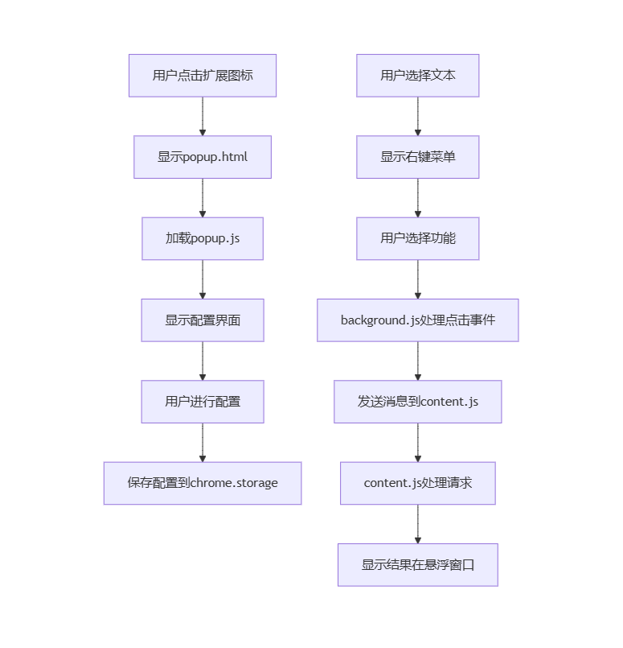
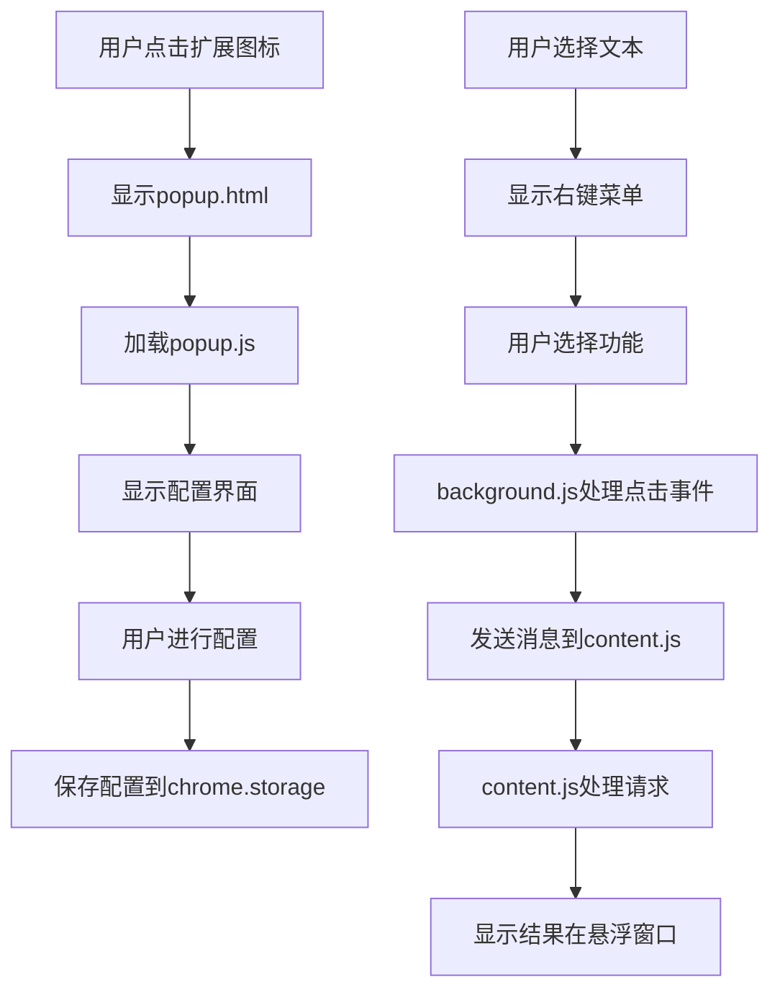

# AI Chat 浏览器扩展

## 项目结构
├── background.js # 后台脚本，处理右键菜单和消息传递
├── content.js # 内容脚本，处理页面交互
├── popup.js # 弹出窗口脚本，管理配置和功能
├── popup.html # 弹出窗口HTML
├── manifest.json # 扩展清单文件
├── styles.css # 样式表
└── README.md # 项目文档

## 主要功能模块

### 1. 初始化后台脚本 (background.js)
- 管理右键上下文菜单
- 处理扩展安装和更新
- 作为消息中转站，协调不同模块间的通信

### 2. 负责页面操作的内容脚本 (content.js)
- 监听页面事件
- 处理用户选择文本
- 显示/隐藏悬浮窗口
- 与后台脚本通信

### 3. 插件面板弹出窗口的js (popup.js)
- 管理API配置
- 管理自定义功能
- 显示当前状态
- 提供快捷操作

## 调用关系图

## 主要功能流程

1. 配置管理
   - 用户通过popup界面添加/修改/删除API配置
   - 配置存储在chrome.storage中
   - 支持启用/禁用特定配置

2. 右键菜单
   - 根据自定义功能动态生成菜单项
   - 用户选择文本后可通过右键菜单快速使用功能
   - 菜单项状态实时更新

3. 消息通信
   - popup.js <-> background.js: 配置更新通知
   - background.js <-> content.js: 处理用户请求
   - content.js <-> 网页: 获取选择文本，显示结果

4. 错误处理
   - 捕获并记录各模块的异常
   - 在界面上显示友好的错误提示
   - 自动恢复失败的操作

## 安装与使用

1. 克隆本仓库
2. 打开Chrome浏览器，进入 `chrome://extensions/`
3. 启用"开发者模式"
4. 点击"加载已解压的扩展程序"，选择项目目录
5. 点击扩展图标开始使用

## 依赖

- Chrome 88+
- Manifest V3

## 许可证

MIT License
